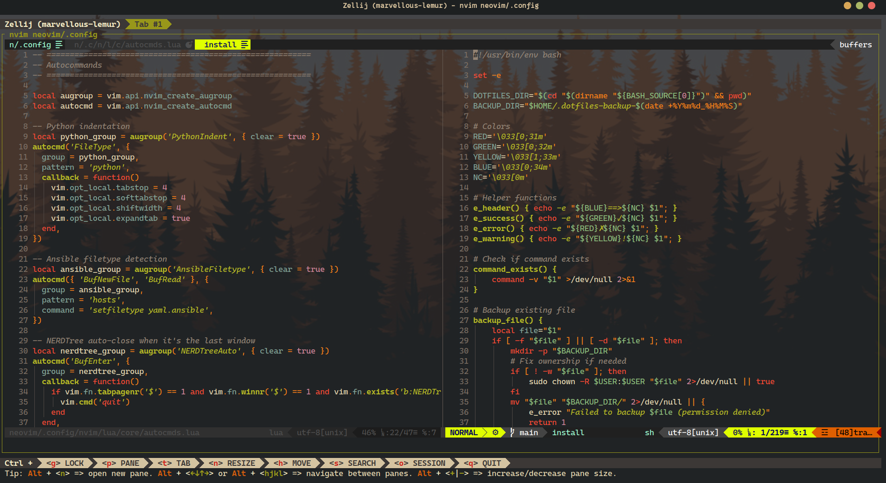
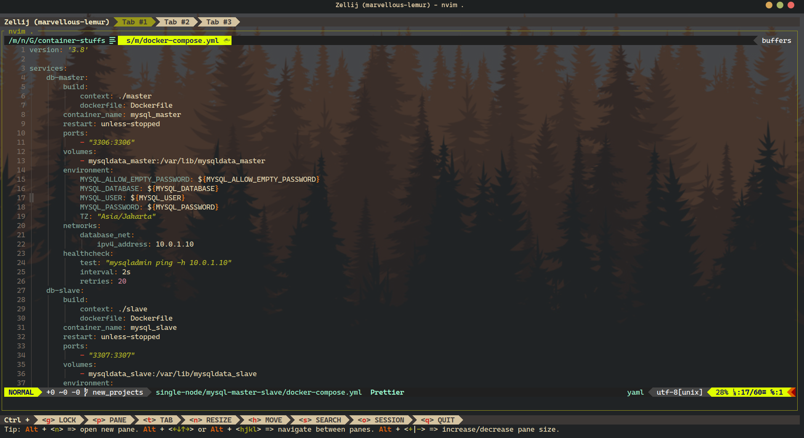
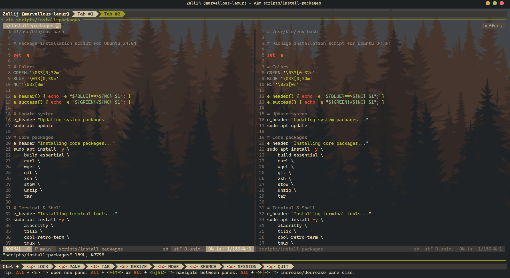
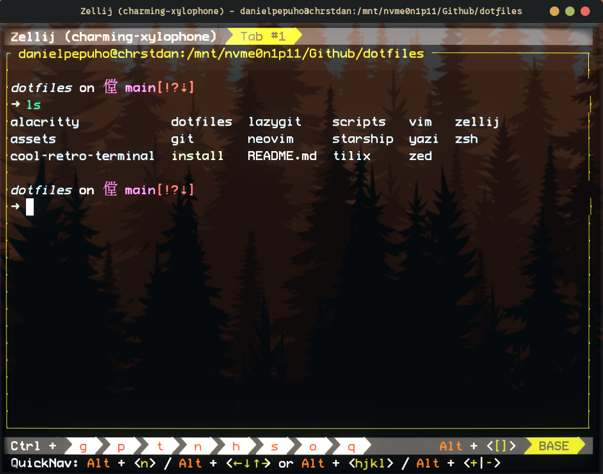

# Dotfiles for Ubuntu 24.04

Personal configuration files for Linux development environment.

## Quick Start

```bash
# Clone repository
git clone https://github.com/danielcristho/dotfiles.git ~/dotfiles
cd ~/dotfiles

# Run installer
./install
```

## What Gets Installed

### Applications

- Alacritty
- Neovim and Vim
- Zsh + Oh My Zsh
- Starship (prompt)
- Zellij (multiplexer)
- Lazygit (git TUI)
- Yazi (file manager)
- Cool Retro Term & Tilix

### Tools

- fzf, ripgrep, fd, bat, eza
- zoxide (smart cd)
- tree-sitter
- Nerd Fonts

### Configurations

- Neovim with Lua config
- Zsh with custom aliases
- Alacritty with Gruvbox theme
- Starship prompt
- Lazygit with vim keybindings
- Yazi file manager

## Installation Options

```bash
# Full installation
./install

# Skip package installation
./install --no-packages

# Skip git sync
./install --no-sync

# Show help
./install --help
```

## Manual Installation

### 1. Install Packages

```bash
./scripts/install-packages.sh
```

### 2. Link Dotfiles

```bash
# Alacritty
ln -sf ~/dotfiles/alacritty/alacritty.toml ~/.config/alacritty/alacritty.toml

# Neovim
ln -sf ~/dotfiles/neovim/.config/nvim ~/.config/nvim

# Zsh
ln -sf ~/dotfiles/zsh/.zshrc ~/.zshrc

# Starship
ln -sf ~/dotfiles/starship/starship.toml ~/.config/starship.toml

# Zellij
ln -sf ~/dotfiles/zellij/config.kdl ~/.config/zellij/config.kdl

# Lazygit
ln -sf ~/dotfiles/lazygit/config.yml ~/.config/lazygit/config.yml

# Yazi
ln -sf ~/dotfiles/yazi/yazi.toml ~/.config/yazi/yazi.toml
```

### 3. Install Neovim Plugins

```bash
nvim +PlugInstall +qall
```

## Keyboard Shortcuts

### Neovim

- `Space` - Leader key
- `Space ff` - Find files (Telescope)
- `Space fg` - Live grep
- `Ctrl+n` - Toggle NERDTree
- `gd` - Go to definition
- `Space ca` - Code action

### Lazygit

- `h/j/k/l` - Navigate
- `Space` - Stage/unstage
- `c` - Commit
- `P` - Push
- `p` - Pull

### Yazi

- `h/j/k/l` - Navigate
- `Space` - Select
- `y` - Copy
- `p` - Paste
- `d` - Delete

## Customization

### Change Terminal Opacity

Edit `alacritty/alacritty.toml`:

```sh
[window]
opacity = 0.95  # 0.0-1.0
```

### Change Neovim Theme

Edit `neovim/.config/nvim/lua/plugins/gruvbox.lua`

### Add Zsh Aliases

Edit `zsh/.zshrc`

## Looks









## Credits

Inspired by:

- [gonstoll/dotfiles](https://github.com/gonstoll/dotfiles)
- [sainnhe/gruvbox-material-alacritty.yml](https://gist.github.com/sainnhe/ad5cbc4f05c4ced83f80e54d9a75d22f)

## License

MIT License - Feel free to use and modify
