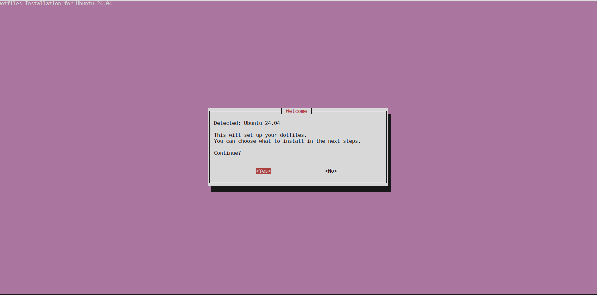
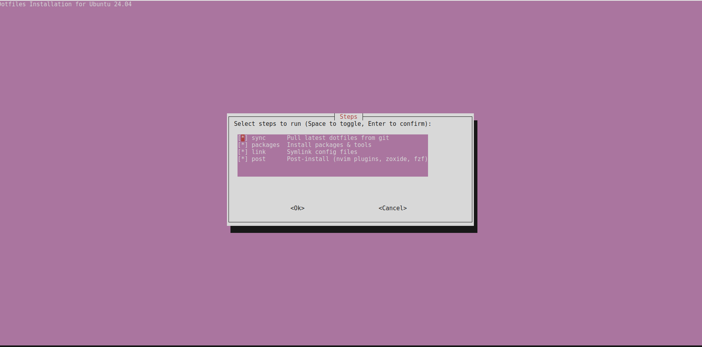
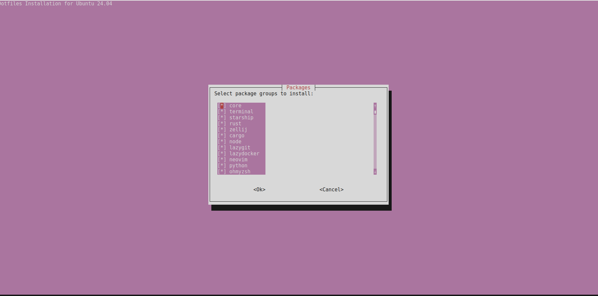
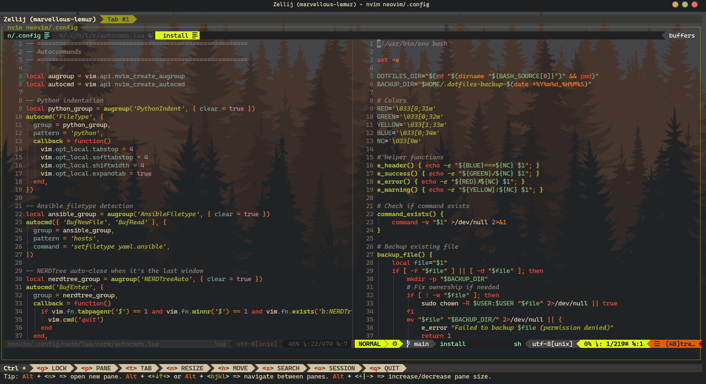
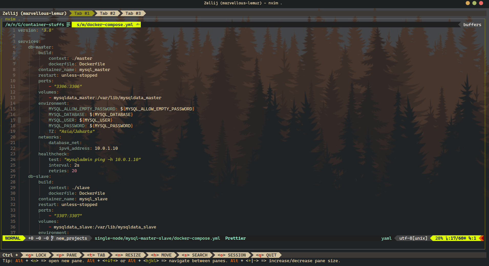
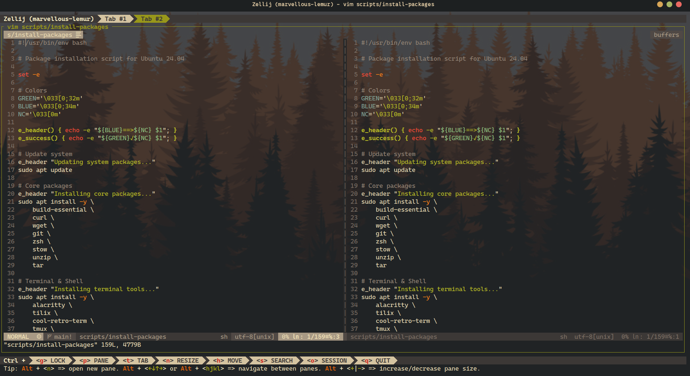
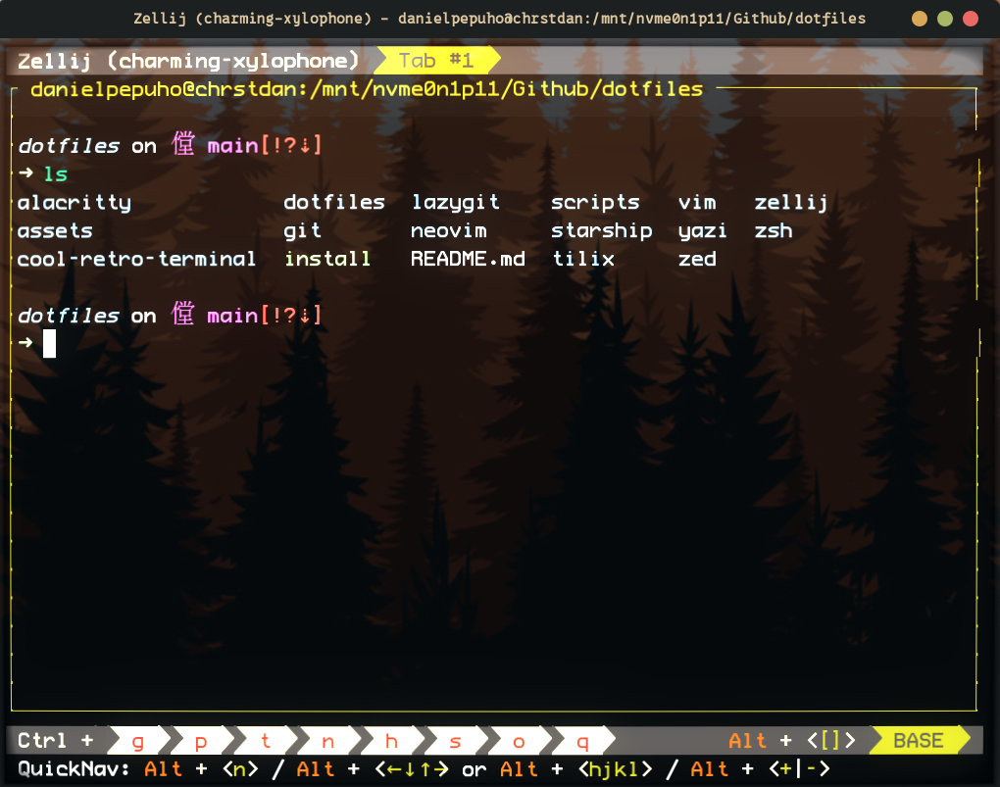

# Dotfiles for Ubuntu 24.04 / 26.04

Personal configuration files for Linux development environment.

## Quick Start

```bash
# Clone repository
git clone https://github.com/danielcristho/dotfiles.git ~/dotfiles
cd ~/dotfiles

# Run installer
./install
```

## What Gets Installed

### Applications

- Alacritty
- Neovim and Vim
- Zsh + Oh My Zsh
- Starship (prompt)
- Zellij (multiplexer)
- Lazygit (git TUI)
- Yazi (file manager)
- Cool Retro Term & Tilix

### Tools

- fzf, ripgrep, fd, bat, eza
- zoxide (smart cd)
- tree-sitter
- Nerd Fonts

### Configurations

- Neovim with Lua config
- Zsh with custom aliases
- Alacritty with Gruvbox theme
- Starship prompt
- Lazygit with vim keybindings
- Yazi file manager

## Installation Options

```bash
# Interactive installation (TUI, choose steps/packages/configs)
./install

# Non-interactive, install everything
./install --yes

# Skip package installation
./install --no-packages

# Skip git sync
./install --no-sync

# Show help
./install --help
```

### Installer TUI

The installer detects your Ubuntu version and lets you pick what to run.







## Manual Installation

### 1. Install Packages

```bash
# All groups
./scripts/install-packages

# Only selected groups (see --list)
./scripts/install-packages core neovim zellij
```

### 2. Link Dotfiles

```bash
# Alacritty
ln -sf ~/dotfiles/alacritty/alacritty.toml ~/.config/alacritty/alacritty.toml

# Neovim
ln -sf ~/dotfiles/neovim/.config/nvim ~/.config/nvim

# Zsh
ln -sf ~/dotfiles/zsh/.zshrc ~/.zshrc

# Starship
ln -sf ~/dotfiles/starship/starship.toml ~/.config/starship.toml

# Zellij
ln -sf ~/dotfiles/zellij/config.kdl ~/.config/zellij/config.kdl

# Lazygit
ln -sf ~/dotfiles/lazygit/config.yml ~/.config/lazygit/config.yml

# Yazi
ln -sf ~/dotfiles/yazi/yazi.toml ~/.config/yazi/yazi.toml
```

### 3. Install Neovim Plugins

```bash
nvim +PlugInstall +qall
```

## Keyboard Shortcuts

### Neovim

- `Space` - Leader key
- `Space ff` - Find files (Telescope)
- `Space fg` - Live grep
- `Ctrl+n` - Toggle NERDTree
- `gd` - Go to definition
- `Space ca` - Code action

### Lazygit

- `h/j/k/l` - Navigate
- `Space` - Stage/unstage
- `c` - Commit
- `P` - Push
- `p` - Pull

### Yazi

- `h/j/k/l` - Navigate
- `Space` - Select
- `y` - Copy
- `p` - Paste
- `d` - Delete

## Customization

### Change Terminal Opacity

Edit `alacritty/alacritty.toml`:

```sh
[window]
opacity = 0.95  # 0.0-1.0
```

### Change Neovim Theme

Edit `neovim/.config/nvim/lua/plugins/gruvbox.lua`

### Add Zsh Aliases

Edit `zsh/.zshrc`

## Development

### Git Hooks

Enable the repo hooks once after cloning:

```bash
git config core.hooksPath .githooks
```

- `pre-commit`: blocks downloaded archives and large files, checks shell syntax, runs ShellCheck, audits download sources and scans for secrets with gitleaks
- `commit-msg`: enforces [Conventional Commits](https://www.conventionalcommits.org) (`feat(install): ...`, `fix: ...`)

ShellCheck and gitleaks are optional locally (the hook skips them with a warning if missing), but they always run in CI.

### Adding a Package Source

The install scripts may only download from reviewed sources. When you add a package that downloads from a new URL:

1. Review the source (who maintains it, is it the official release?)
2. Add its narrowest URL prefix to `.github/security/allowed-sources.txt`
3. If it is piped into a shell (`curl ... | sh`), also add the exact URL to `.github/security/allowed-remote-scripts.txt`

Run `scripts/audit-sources` to check locally.

### CI

- **CI**: ShellCheck, syntax check, and installer tests on Ubuntu 24.04 and 26.04
- **Security**: gitleaks secret scan, download source audit (lists packages added in a PR), and zizmor audit of the workflows. Also runs weekly.

## Looks









## Credits

- [gonstoll/dotfiles](https://github.com/gonstoll/dotfiles)
- [sainnhe/gruvbox-material-alacritty.yml](https://gist.github.com/sainnhe/ad5cbc4f05c4ced83f80e54d9a75d22f)

## License

MIT License - Feel free to use and modify
